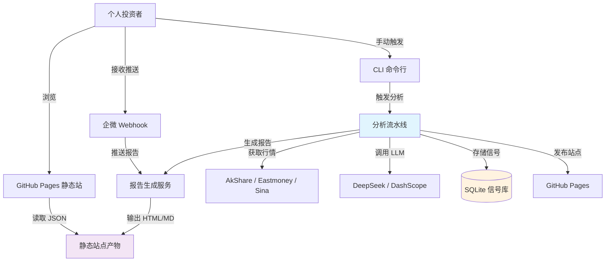
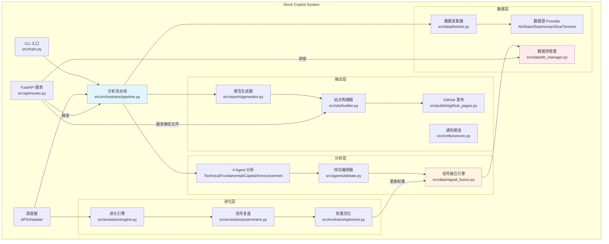
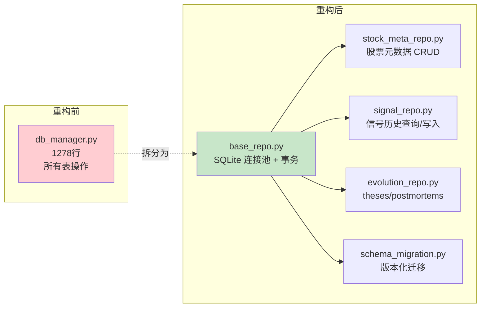
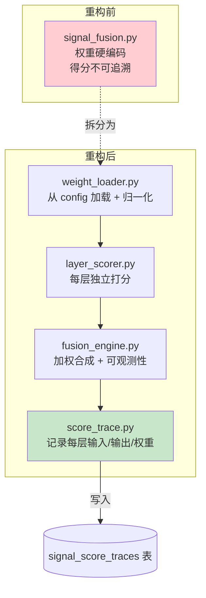
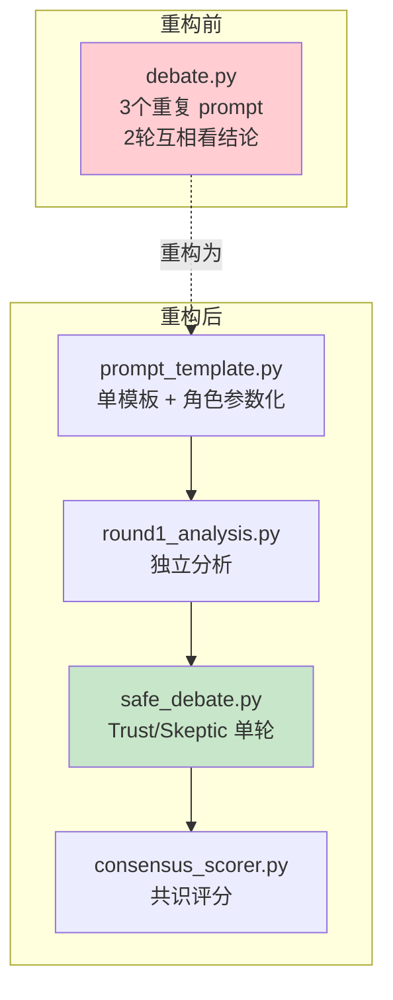

# C4 Architecture — Stock Copilot (重构后目标架构)

## Level 1: Context Diagram



**说明**:
- **User**: 个人投资者（当前仅自用）
- **Pipeline**: 核心分析流水线（数据采集 → Agent 分析 → 信号融合 → 报告生成）
- **SQLite**: 信号历史 + 元数据 + 进化记录
- **StaticSite**: GitHub Pages 静态产物（HTML + JSON）

---

## Level 2: Container Diagram



**重构重点**:
1. **Pipeline** 保持核心地位，但拆分为更细粒度的 Step
2. **DBManager** 拆为多个 Repository（StockMetaRepo / SignalRepo / EvolutionRepo）
3. **Fusion** 增加可观测性（每层得分可追溯）
4. **SiteBuilder** 从 generator.py 拆出，独立负责 HTML 生成

---

## Level 3: Component Diagram (核心模块)

### 3.1 数据层重构



### 3.2 信号融合重构



**新增表**: `signal_score_traces`
```sql
CREATE TABLE signal_score_traces (
    id INTEGER PRIMARY KEY,
    code TEXT NOT NULL,
    trade_date TEXT NOT NULL,
    report_type TEXT NOT NULL,
    
    -- 每层得分
    hard_score REAL,
    hard_weight REAL,
    soft_score REAL,
    soft_weight REAL,
    gate_score REAL,
    gate_weight REAL,
    dragon_tiger_score REAL,
    dragon_tiger_weight REAL,
    announcement_score REAL,
    announcement_weight REAL,
    
    -- 最终得分
    final_score REAL,
    final_signal TEXT,
    
    -- 元数据
    weights_version TEXT,  -- 引用 fusion_weights.json 版本
    created_at TEXT DEFAULT (datetime('now'))
);
```

### 3.3 多 Agent 辩论重构



**FinDebate 启发**:
- **单轮安全辩论**: Trust Agent 补充证据，Skeptic Agent 注入风险，Leader Agent 综合
- **禁止翻转**: 辩论不改变方向性结论（bullish/bearish），仅精炼
- **共识加成**: 3 Agent 一致 → confidence +0.1；分歧 → confidence -0.1

---

## 重构实施计划

### Phase 1: 基础设施（Day 1-2）
- [ ] 引入 `alembic` 或轻量 schema migration
- [ ] 拆 `db_manager.py` → `repos/*.py`
- [ ] 配置外部化（Eastmoney token / API URL → settings.yaml）

### Phase 2: 融合引擎（Day 3-4）
- [ ] 修正 docstring（60/30/10 → 40/25/15/10/10）
- [ ] 引入 `signal_score_traces` 表
- [ ] 拆 `signal_fusion.py` → `weight_loader.py` + `layer_scorer.py` + `fusion_engine.py`

### Phase 3: Agent 辩论（Day 5）
- [ ] 提取 prompt 模板（参数化角色）
- [ ] 实现单轮安全辩论（Trust/Skeptic/Leader）
- [ ] 共识评分加成

### Phase 4: 站点生成（Day 6-7）
- [ ] 拆 `generator.py` → `data_transform.py` + `templates/*.html` + `builder.py`
- [ ] HTML 模板外置（Jinja2 文件）

### Phase 5: API 分层（Day 8）
- [ ] 拆 `routes.py` → `routes/*.py` + `services/*.py`
- [ ] 业务逻辑下沉到 Service 层

### Phase 6: CI/CD + 测试（Day 9-10）
- [ ] GitHub Actions 自动 pytest + ruff
- [ ] 补充 ≥20 测试覆盖重构模块
- [ ] 116 原有测试继续通过

**总计**: 10 天（单人全职）
