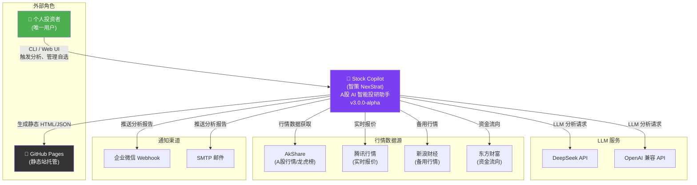

# C4 Level 1 — System Context Diagram

## Stock Copilot (智策 NexStrat) — 系统上下文

## 关键关系说明

| 关系 | 协议 | 频率 | 说明 |
|------|------|------|------|
| User → System | HTTP/CLI | 按需 | FastAPI :8000 + CLI 命令 |
| System → GitHub | Git push | 每日 1-2 次 | 静态站发布 |
| System → LLM | HTTPS/REST | 每只股票 2-4 次 | 技术/资金/基本面/公告分析 + 辩论 |
| System → 行情 | HTTPS/REST | 每日 + 盘中 2min | AkShare 为主，腾讯/新浪备用 |
| System → 通知 | Webhook/SMTP | 分析完成后 | 推送报告摘要 |
