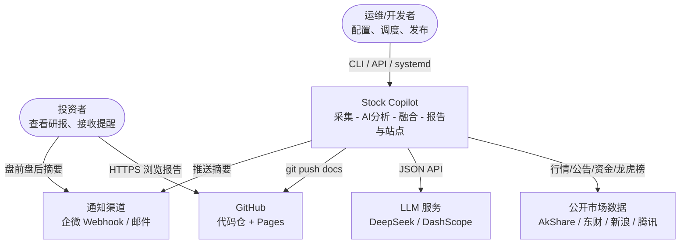
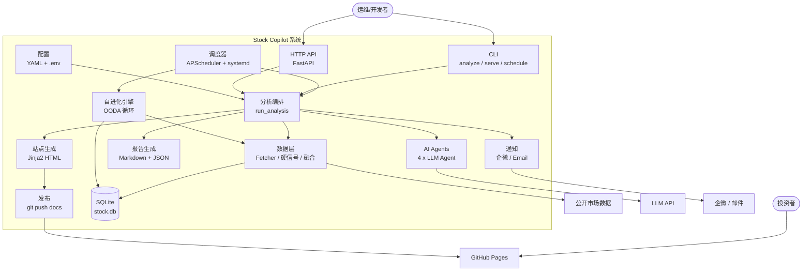
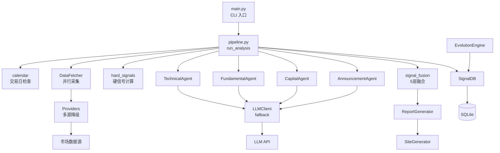
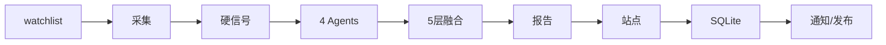
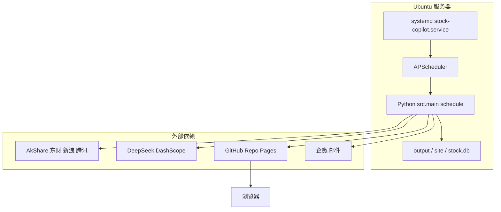

# Stock Copilot（智策）产品设计总结 · C4 架构

> **版本**: v1.3.0  
> **更新日期**: 2026-05-26  
> **说明**: 基于 `docs/design/` 与当前代码库整理，采用 [C4 Model](https://c4model.com/) 描述系统架构。  
> **图表**: 使用标准 Mermaid `flowchart`（GitHub / VS Code / Cursor 均可渲染；`C4Context` 等 C4 扩展语法多数环境不支持）。

---

## 一、产品设计概要

| 维度 | 内容 |
|------|------|
| **产品名** | Stock Copilot（智策） |
| **定位** | 基于 AI 的 A 股**个人投研助手**：看全、看懂、及时提醒 |
| **用户** | 有个人炒股经验、希望提升决策效率的投资者（当前以自用为主） |
| **核心价值** | 把行情、公告、资金、估值等分散信息 → **结构化信号 + 报告 + 静态站点** |
| **边界** | 个人研究工具；**不构成投资建议**；不自动下单、不对外投顾 |
| **交付形态** | Markdown 报告、`latest.json`、深色 Fintech 静态 Web（GitHub Pages）、企微/邮件推送 |
| **演进状态** | MVP + Phase A（信号融合/SQLite）+ Phase B（龙虎榜/公告/5 层融合/UI）✅；Evolution 自进化循环 ✅；Phase 2/3 规划中 |

### 核心数据流（一次分析）

```
watchlist → 多源采集(降级链) → 硬信号 → 4×LLM Agent → 5层融合 → 报告/站点 → SQLite/通知/GitHub Pages
```

### 5 层信号融合（产品核心创新）

```
最终评分 = 硬信号(40%) + LLM软信号(25%) + 门控(15%) + 龙虎榜(10%) + 公告(10%)
```

- 数据缺失时权重动态重分配
- ST/停牌股直接过滤

### 信号分类

| 分数区间 | 信号 | 图标 |
|----------|------|------|
| ≥ +0.6 | strong_buy | 🟢 强烈看多 |
| +0.2 ~ +0.6 | buy | 🟢 看多 |
| -0.2 ~ +0.2 | hold | ⚪ 观望 |
| -0.6 ~ -0.2 | sell | 🔴 看空 |
| < -0.6 | strong_sell | 🔴 强烈看空 |

### 数据源降级链

| 数据类型 | 主选 | 备选 1 | 备选 2 |
|----------|------|--------|--------|
| K 线 | AkShare | Sina | Tencent |
| 估值 | Eastmoney push2 | Tencent | - |
| 资金流 | Eastmoney push2 | AkShare | - |
| 公告 | AkShare | - | - |
| 龙虎榜 | Eastmoney datacenter | - | - |

---

## 二、C4 Model 架构图

### Level 1 — System Context（系统上下文）

谁在用系统、系统与外部世界的关系。



---

### Level 2 — Container（容器）

系统内部的主要技术块及交互。



---

### Level 3 — Component（组件）

聚焦 **分析编排容器（Pipeline + Data + Agents）** 的内部结构——产品「大脑」。



**分析流水线顺序（补充）：**



---

### 部署视图（运行时）

生产环境常见形态（来自 `RUNBOOK` / `stock-copilot.service`）：



---

## 三、各 C4 层级对照

| C4 层级 | Stock Copilot 对应 |
|---------|-------------------|
| **Context** | 投资者通过 GitHub Pages 看报告；系统从公开市场取数、调 LLM、可选推送与发布 |
| **Container** | CLI/API/调度器驱动 Pipeline；Data+Agents 决策；Reports+Site+Publish 交付；Evolution 闭环优化 |
| **Component** | `pipeline.py` 串联 Fetcher → HardSignals → 4 Agents → `fuse_signals` → Report/Site/DB |
| **Code**（未展开） | `StockSnapshot`、`FusedSignal`、`AgentResult` 等 Pydantic 模型；各 Provider 与 Agent 实现类 |

---

## 四、Agent 角色（4 Agent）

| Agent | 职责 | 输入 | 输出 |
|-------|------|------|------|
| Technical | 技术面分析 | 近 20 条日线 + MA5/10/20 | trend, key_signals, summary, confidence |
| Fundamental | 基本面分析 | 近 7 日公告 | 利好/利空, summary, risk_points |
| Capital | 资金面分析 | 资金流数据 | 资金态度, summary, risk_points |
| Announcement | 公告关键词提取 | 公告标题列表 | key_events[], sentiment, risk_flags[] |

综合研判由 `fuse_signals()` 信号融合引擎完成，不再使用简单投票机制。

---

## 五、关键设计决策

1. **多源降级链**：K 线、估值、资金流分别主备切换，单股失败不拖垮整批。
2. **硬 + 软 + 规则**：量化硬信号与 LLM 软信号分离，门控/龙虎榜/公告加权，降低「纯 LLM 拍脑袋」。
3. **LLM 多 Provider**：`fallback` 主备切换，`concurrent` 竞速；结构化 JSON 输出。
4. **静态站点优先**：`site/` → `docs/` → GitHub Pages，无后端也能读报告。
5. **Evolution（v1.3+）**：基于历史信号验证表现，动态调融合权重、维护股票池（OODA 循环）。
6. **合规内建**：免责声明、不做买卖指令、个人研究定位。

---

## 六、演进路线

| 阶段 | 名称 | 核心能力 | 状态 |
|------|------|----------|------|
| MVP | 路线 A 轻量版 | 自选股 + 3 Agent + Markdown + 静态网页 + GitHub Pages | ✅ |
| Phase A | 信号融合 + 持久化 | 三层/五层融合 + SQLite | ✅ |
| Phase B | 信息挖掘 + UI | 龙虎榜 + 公告 + UI 重构 + 自检 | ✅ |
| v1.3 | 自进化 + 运维 | EvolutionEngine + systemd + RUNBOOK | ✅ |
| Phase 2 | 完整决策平台 | Web UI 交互、多空辩论、Tushare 本地库 | 📋 |
| Phase 3 | 量化闭环 | 回测、模拟盘、miniQMT | 📋 |

---

## 七、相关文档

| 文档 | 说明 |
|------|------|
| [design/01-DESIGN.md](design/01-DESIGN.md) | 整体方案设计 |
| [design/03-ARCHITECTURE.md](design/03-ARCHITECTURE.md) | 技术架构与目录结构 |
| [design/08-CURRENT-STATUS.md](design/08-CURRENT-STATUS.md) | 当前系统状态 SSOT |
| [RUNBOOK.md](RUNBOOK.md) | 运维手册 |
| [UI-UX-Style.md](UI-UX-Style.md) | UI/UX 设计规范 |

**线上站点**: https://ttmens.github.io/stock-copilot/
