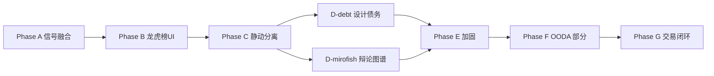

# 产品路线图

> 版本 3.0.0-alpha | 详见 [VERSION.md](../VERSION.md)

## 阶段总览

| Phase | 名称 | 状态 |
|-------|------|------|
| A–E | 信号融合 / UI / 静动 / 加固 | Delivered |
| F | OODA 反馈（部分） | Partial |
| **G** | **日更知识库 + 推荐池 + 竞价/盘中 + 复盘 + 仓位** | **Alpha** |

## Phase G（3.0.0-alpha）

| ID | 能力 | 状态 |
|----|------|------|
| G1 | 日更知识库 digest | Delivered |
| G2–G3 | 外盘 / 期货 | Delivered |
| G4 | 推荐池 3×3 | Delivered |
| G5 | 竞价监测 | Delivered |
| G6 | 盘中预警 | Delivered |
| G7 | 复盘 + 深度分析 | Delivered |
| G8 | 单用户仓位 | Delivered |
| G-UI | 双轨 Live Cockpit | Delivered |

规格：[phase-g-product-spec.md](phase-g-product-spec.md)

## Phase F 待办（部分并入 G7）

- 策略停滞模块 `evolution/stagnation.py`
- 相关性 `data/correlation.py`
- 多周期 hard signals
- Postmortem 反馈接入 EvolutionEngine（G7 复盘已部分闭环）

## 明确不做

- Tushare 本地库、Redis/Celery/Docker
- 完整 LangGraph 多空辩论
- 多租户、自动下单、Tick 级流

## 历史计划

归档于 [archive/phase-plans/](../archive/phase-plans/) — 含 [17-PHASE-G-PLAN.md](../archive/phase-plans/17-PHASE-G-PLAN.md)
