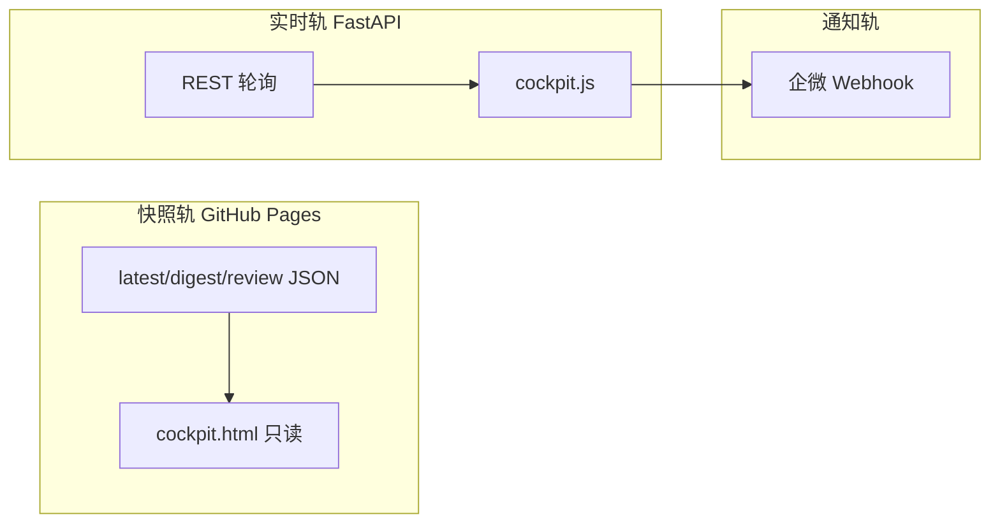

# Hermes Agent — Cockpit 运维交接

面向 Agent 运行 **智策 NexStrat** 单页 Cockpit 与双轨 UI 的操作手册。

## 系统概览



| 轨道 | 时段 | 数据源 |
|------|------|--------|
| 快照 | 盘前/盘后 | `docs/data/*.json` |
| 实时 | 09:15–15:00 | FastAPI + 轮询 |
| 通知 | 全天 | 企微 |

**主入口 URL**：`/app/cockpit.html`（`index.html` 自动 redirect）

## 每日操作时间表

| Session | 时间（约） | Agent 关注 | API / Job |
|---------|-----------|-----------|-----------|
| pre_market | 06:00–09:15 | 情报 + 推荐池 | digest job, pool refresh |
| auction | 09:15–09:25 | 竞价面板 | `/api/auction/latest` 60s |
| morning | 09:30–11:30 | 预警 + 池 | `/api/alerts`, pool 120s |
| lunch | 11:30–13:00 | 低频轮询 | 可选 5min |
| afternoon | 13:00–15:00 | 同 morning | 同上 |
| post_market | 15:30+ | 复盘 | review.json 静态 |

## 本地运行

```bash
cd stock-copilot
python -m src.main serve --port 8000
```

浏览器打开：http://127.0.0.1:8000/app/cockpit.html

生成/更新静态站（含 sync 到 docs）：

```bash
python -m src.main generate   # 以项目实际 CLI 为准
```

## 配置清单

| 文件 | 用途 |
|------|------|
| `config/settings.yaml` | API、scheduler、phase_g、CORS |
| `src/site/app/config.js` | `PRODUCTION_API_BASE`（GitHub Pages 连 VPS） |
| `src/site/app/api-client.js` | 同源 / 离线 Banner |
| 企微 webhook | `config/settings.yaml` notify 段 |

GitHub Pages 需在 `api.cors_origins` 包含 `https://ttmens.github.io`。

## 文件地图

| 路径 | 说明 |
|------|------|
| `src/site/app/cockpit.html` | 单页壳（Hero/Timeline/3 Tab） |
| `src/site/app/cockpit.js` | 面板 load、Focus/Peek、轮询 |
| `src/site/app/ui-render.js` | 卡片/dashboard HTML render SSOT |
| `src/site/app/layout.js` | Tab hash 路由 |
| `src/site/app/live.js` | PHASE_LABELS、poll 工具 |
| `src/site/theme.css` | 设计系统实现 |
| `src/site/generator.py` | 静态站烘焙 + nav |
| `docs/data/latest.json` | 自选快照 |
| `docs/data/digest.json` | 盘前情报快照 |
| `docs/data/recommendation.json` | 推荐池快照 |
| `docs/data/review.json` | 复盘快照 |

## 发布流程

1. 改 UI：`documentation/design-system/tokens.md` → `src/site/theme.css`
2. 改逻辑：`src/site/app/*.js`
3. 烘焙站点（generator）或手动 sync：
   - `src/site/app/*` → `docs/app/`
   - `src/site/theme.css` → `docs/assets/theme.css`
4. `python scripts/check_docs_ssot.py`
5. Push → GitHub Pages

## 验收命令

```bash
python -m pytest tests/ -q
python scripts/check_docs_ssot.py
python scripts/ui_acceptance.py --full
```

## 故障排查

| 现象 | 检查 |
|------|------|
| 顶栏「实时需连接服务器」 | API 未启动或 `config.js` BASE 错误 |
| 卡片只有 code/name | `ui-render.js` 未加载或 404 |
| 旧书签 404 | 应为 redirect stub → `cockpit.html#today` |
| 样式不一致 | `docs/assets/theme.css` 是否与 `src/site/theme.css` sync |

## UI 改动规则

1. 先改 `tokens.md`，再改 `theme.css`
2. 卡片 HTML 改 `ui-render.js`（与 generator 保持 parity）
3. 禁止 CDN / Tailwind
4. 375px + 1280px 走查后再发布

## 相关文档

- [ui-phase-g.md](../reference/ui-phase-g.md) — IA + Journey 规格
- [ui-product.md](../reference/ui-product.md) — 产品说明
- [ui-hybrid-setup.md](../guides/ui-hybrid-setup.md) — 双轨配置
